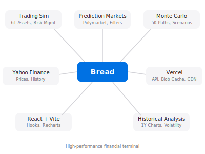

# Rise

Low-latency financial terminal with prediction markets, trading simulator, and quantitative analysis.

**Live**: https://rise-production.vercel.app | **Docs**: https://heyitsmejosh.com/rise/



## Features

- **Trading Simulator**: 61 assets, autonomous algorithm, 50ms tick rate, $1 → $1T continuous run (Fibonacci milestones, no interruptions)
- **Prediction Markets**: Real-time Polymarket feeds with probability filters
- **Monte Carlo**: 5K-path simulations with bull/base/bear scenarios
- **Live Data**: Yahoo Finance stocks, commodities, crypto

## Quick Start

```bash
git clone https://github.com/nulljosh/rise.git
cd rise
npm install
npm run dev
```

Opens at http://localhost:5173

## Tech Stack

- React 19 + Vite
- Recharts for visualization
- Polymarket + Yahoo Finance APIs
- Custom Monte Carlo engine
- Vercel deployment

## Architecture Goals

| Metric | Target | Current |
|--------|--------|---------|
| Bundle Size | <500KB | 233KB |
| Memory | <10MB | ~177KB |
| API Latency | <100ms | ~200ms |
| React Warnings | 0 | 0 |

## Development

```bash
npm test              # Run tests
npm run build         # Production build
npm run test:speed    # Playwright speed test
```

**Structure**:
- `api/` - Serverless functions (markets, stocks, commodities)
- `src/` - React components and hooks
- `src/utils/` - Monte Carlo math, asset config

## Monetization

Free tier includes all features. Pro tier ($49/mo) adds:
- cTrader auto-trading integration
- TradingView webhooks
- Priority API access

## Deployment

**Vercel**: Auto-deploys from main branch via GitHub Actions

**GitHub Pages**: https://heyitsmejosh.com/rise/ (static build)

## Roadmap

**P0 — Critical (must ship)**
- [ ] Improve win rate 70% → 85% (entry filter tuning)
- [ ] Run history persistence (localStorage or Blob)
- [ ] Polymarket + Situation Monitor integration

**P1 — High priority**
- [ ] Historical backtesting against real OHLCV data
- [ ] Kalshi prediction market integration
- [ ] Custom ticker input by user

**P2 — Feature complete**
- [ ] Black-Scholes options pricing UI
- [ ] Price alerts / push notifications
- [ ] Situation Monitor panel (real-time news → PM market correlation)

**P3 — Performance**
- [ ] Delta-Threshold bandwidth optimization
- [ ] Binary payload compression
- [ ] WebSocket real-time feeds (replace polling)

**P4 — Pro tier**
- [ ] TradingView webhook auto-trading
- [ ] Interactive Brokers live API connection
- [ ] Paper trading mode (live prices, sim risk)

**P5 — Long-term**
- [ ] C++ core with WASM bridge
- [ ] Academic white paper publication

## Links

- [Issues](https://github.com/nulljosh/rise/issues)
- [Discussions](https://github.com/nulljosh/rise/discussions)
- [Twitter](https://twitter.com/trommatic)

---

Built with Claude Sonnet 4.5 | MIT License | Not financial advice

## Project Map

```svg
<svg viewBox="0 0 680 420" width="100%" style="max-width:680px;font-family:monospace;background:#f8fafc;border-radius:12px" xmlns="http://www.w3.org/2000/svg">
  <rect width="680" height="420" fill="#f8fafc" rx="12"/>
  <text x="340" y="24" font-size="13" font-weight="bold" fill="#0f172a" text-anchor="middle">rise — Financial Terminal</text>

  <!-- Root -->
  <rect x="290" y="38" width="100" height="28" rx="6" fill="#0071e3"/>
  <text x="340" y="57" font-size="11" fill="white" text-anchor="middle">rise/</text>

  <!-- Dashed connectors root → children -->
  <line x1="340" y1="66" x2="340" y2="80" stroke="#94a3b8" stroke-width="1" stroke-dasharray="4,3"/>
  <line x1="80" y1="80" x2="600" y2="80" stroke="#94a3b8" stroke-width="1" stroke-dasharray="4,3"/>

  <!-- src/ -->
  <line x1="80" y1="80" x2="80" y2="94" stroke="#94a3b8" stroke-width="1" stroke-dasharray="4,3"/>
  <rect x="34" y="94" width="92" height="26" rx="6" fill="#6366f1"/>
  <text x="80" y="111" font-size="11" fill="white" text-anchor="middle">src/</text>
  <!-- src children -->
  <line x1="80" y1="120" x2="80" y2="134" stroke="#64748b" stroke-width="1"/>
  <rect x="22" y="134" width="116" height="22" rx="4" fill="#e0e7ff"/>
  <text x="80" y="149" font-size="10" fill="#3730a3" text-anchor="middle">components/</text>
  <line x1="80" y1="156" x2="80" y2="170" stroke="#64748b" stroke-width="1"/>
  <rect x="22" y="170" width="116" height="22" rx="4" fill="#e0e7ff"/>
  <text x="80" y="185" font-size="10" fill="#3730a3" text-anchor="middle">hooks/</text>
  <line x1="80" y1="192" x2="80" y2="206" stroke="#64748b" stroke-width="1"/>
  <rect x="22" y="206" width="116" height="22" rx="4" fill="#e0e7ff"/>
  <text x="80" y="221" font-size="10" fill="#3730a3" text-anchor="middle">utils/</text>
  <line x1="80" y1="228" x2="80" y2="242" stroke="#64748b" stroke-width="1"/>
  <rect x="22" y="242" width="116" height="22" rx="4" fill="#e0e7ff"/>
  <text x="80" y="257" font-size="10" fill="#3730a3" text-anchor="middle">App.jsx</text>
  <line x1="80" y1="264" x2="80" y2="278" stroke="#64748b" stroke-width="1"/>
  <rect x="22" y="278" width="116" height="22" rx="4" fill="#e0e7ff"/>
  <text x="80" y="293" font-size="10" fill="#3730a3" text-anchor="middle">main.jsx</text>

  <!-- api/ -->
  <line x1="220" y1="80" x2="220" y2="94" stroke="#94a3b8" stroke-width="1" stroke-dasharray="4,3"/>
  <rect x="174" y="94" width="92" height="26" rx="6" fill="#6366f1"/>
  <text x="220" y="111" font-size="11" fill="white" text-anchor="middle">api/</text>
  <!-- api children -->
  <line x1="220" y1="120" x2="220" y2="134" stroke="#64748b" stroke-width="1"/>
  <rect x="162" y="134" width="116" height="22" rx="4" fill="#e0e7ff"/>
  <text x="220" y="149" font-size="10" fill="#3730a3" text-anchor="middle">markets.js</text>
  <line x1="220" y1="156" x2="220" y2="170" stroke="#64748b" stroke-width="1"/>
  <rect x="162" y="170" width="116" height="22" rx="4" fill="#e0e7ff"/>
  <text x="220" y="185" font-size="10" fill="#3730a3" text-anchor="middle">stocks*.js</text>
  <line x1="220" y1="192" x2="220" y2="206" stroke="#64748b" stroke-width="1"/>
  <rect x="162" y="206" width="116" height="22" rx="4" fill="#e0e7ff"/>
  <text x="220" y="221" font-size="10" fill="#3730a3" text-anchor="middle">cron.js</text>
  <line x1="220" y1="228" x2="220" y2="242" stroke="#64748b" stroke-width="1"/>
  <rect x="162" y="242" width="116" height="22" rx="4" fill="#e0e7ff"/>
  <text x="220" y="257" font-size="10" fill="#3730a3" text-anchor="middle">latest.js</text>
  <line x1="220" y1="264" x2="220" y2="278" stroke="#64748b" stroke-width="1"/>
  <rect x="162" y="278" width="116" height="22" rx="4" fill="#e0e7ff"/>
  <text x="220" y="293" font-size="10" fill="#3730a3" text-anchor="middle">stripe-*.js</text>
  <line x1="220" y1="300" x2="220" y2="314" stroke="#64748b" stroke-width="1"/>
  <rect x="162" y="314" width="116" height="22" rx="4" fill="#e0e7ff"/>
  <text x="220" y="329" font-size="10" fill="#3730a3" text-anchor="middle">news.js / weather.js</text>

  <!-- tests/ -->
  <line x1="340" y1="80" x2="340" y2="94" stroke="#94a3b8" stroke-width="1" stroke-dasharray="4,3"/>
  <rect x="294" y="94" width="92" height="26" rx="6" fill="#6366f1"/>
  <text x="340" y="111" font-size="11" fill="white" text-anchor="middle">tests/</text>
  <line x1="340" y1="120" x2="340" y2="134" stroke="#64748b" stroke-width="1"/>
  <rect x="282" y="134" width="116" height="22" rx="4" fill="#e0e7ff"/>
  <text x="340" y="149" font-size="10" fill="#3730a3" text-anchor="middle">api/ · speed.spec.js</text>

  <!-- public/ -->
  <line x1="460" y1="80" x2="460" y2="94" stroke="#94a3b8" stroke-width="1" stroke-dasharray="4,3"/>
  <rect x="414" y="94" width="92" height="26" rx="6" fill="#6366f1"/>
  <text x="460" y="111" font-size="11" fill="white" text-anchor="middle">public/</text>
  <line x1="460" y1="120" x2="460" y2="134" stroke="#64748b" stroke-width="1"/>
  <rect x="402" y="134" width="116" height="22" rx="4" fill="#fef3c7"/>
  <text x="460" y="149" font-size="10" fill="#92400e" text-anchor="middle">index.html</text>

  <!-- Config files -->
  <line x1="600" y1="80" x2="600" y2="94" stroke="#94a3b8" stroke-width="1" stroke-dasharray="4,3"/>
  <rect x="540" y="94" width="120" height="26" rx="6" fill="#6366f1"/>
  <text x="600" y="111" font-size="11" fill="white" text-anchor="middle">config files</text>
  <line x1="600" y1="120" x2="600" y2="134" stroke="#64748b" stroke-width="1"/>
  <rect x="540" y="134" width="120" height="22" rx="4" fill="#e0f2fe"/>
  <text x="600" y="149" font-size="10" fill="#0369a1" text-anchor="middle">vite.config.js</text>
  <line x1="600" y1="156" x2="600" y2="170" stroke="#64748b" stroke-width="1"/>
  <rect x="540" y="170" width="120" height="22" rx="4" fill="#e0f2fe"/>
  <text x="600" y="185" font-size="10" fill="#0369a1" text-anchor="middle">vercel.json</text>
  <line x1="600" y1="192" x2="600" y2="206" stroke="#64748b" stroke-width="1"/>
  <rect x="540" y="206" width="120" height="22" rx="4" fill="#e0f2fe"/>
  <text x="600" y="221" font-size="10" fill="#0369a1" text-anchor="middle">package.json</text>
  <line x1="600" y1="228" x2="600" y2="242" stroke="#64748b" stroke-width="1"/>
  <rect x="540" y="242" width="120" height="22" rx="4" fill="#e0f2fe"/>
  <text x="600" y="257" font-size="10" fill="#0369a1" text-anchor="middle">vitest.config.js</text>

  <!-- Legend -->
  <rect x="20" y="360" width="14" height="14" rx="3" fill="#0071e3"/>
  <text x="40" y="371" font-size="9" fill="#64748b">root</text>
  <rect x="80" y="360" width="14" height="14" rx="3" fill="#6366f1"/>
  <text x="100" y="371" font-size="9" fill="#64748b">folder</text>
  <rect x="150" y="360" width="14" height="14" rx="3" fill="#e0e7ff"/>
  <text x="170" y="371" font-size="9" fill="#64748b">source</text>
  <rect x="220" y="360" width="14" height="14" rx="3" fill="#e0f2fe"/>
  <text x="240" y="371" font-size="9" fill="#64748b">config</text>
  <rect x="290" y="360" width="14" height="14" rx="3" fill="#fef3c7"/>
  <text x="310" y="371" font-size="9" fill="#64748b">entry</text>
</svg>
```
