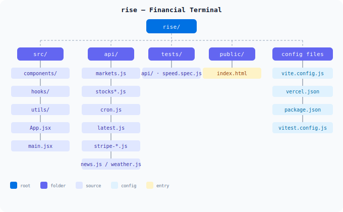

# Opticon

Financial terminal with live markets, prediction signals, situation monitor, personal finance dashboard, and a paper-trading simulator.

**Live**: https://opticon.heyitsmejosh.com
**Docs**: https://heyitsmejosh.com/opticon/



## Stack

- React 19 + Vite
- Vercel serverless API gateway (`api/gateway.js`) + handlers in `server/api/`
- FMP (Financial Modeling Prep) primary + Yahoo Finance fallback
- Polymarket prediction markets
- Personal finance panel (portfolio, budget, debt tracker, spending trends)
- Situation Monitor map (flights, traffic, construction incidents, seismic, crime, local events)
- Global geopolitical event feed (GDELT panel)
- Auth system (bcrypt + httpOnly cookie sessions + email verification)
- Vercel KV for persistent storage (user accounts, sessions, portfolio data)
- Vitest + Playwright tests

## Personal Finance

The **Portfolio** panel provides:

- Live-valued stock holdings with gain/loss tracking
- Cash accounts and net worth calculation
- Monthly budget breakdown (income, expenses, surplus)
- Debt tracker with progress bars and payoff timeline
- Goal tracking with priority levels
- Spending trends chart with category breakdown
- JSON import/export for custom balance sheets
- Drag-and-drop file upload
- Server-side persistence via `/api/portfolio` (KV-backed, syncs when authenticated)
- CLI access via `balance` command

Demo data loads by default. Upload your own JSON to replace it.

## Map-First Mode

- Full-page live map backdrop with pulsing event markers
- Tactical HUD visual pass inspired by map-intel interfaces (grid + status badge + neon controls)
- Fast default map startup at NYC, then geolocation recenter when available
- Small-town zoom behavior: when device location is available, map auto-focuses at neighborhood-level detail
- User location drop-pin (`YOU`) + recenter control
- Local overlays: traffic incidents + construction/barriers + seismic events + crime + local events
- Prediction markets projected onto geographic anchors
- Global feed pulses: geopolitical events
- Viewport-based local refresh: panning to a new city refreshes local overlays
- Baseline fallback local markers keep map non-empty when upstream feeds are sparse

## Trading Simulator

Paper-trading simulator that runs from $1 to $1T+ with Fibonacci milestone checkpoints.

- Position sizing tiers scale from 70% (micro) down to 15% (large), with extended tiers for $1B+ balances
- 1.7% hard stop loss, trailing stop activates at +2% unrealized
- Volatility filter skips trades above 2.5% stddev
- Momentum strength filter scales with balance tier
- Fibonacci levels trigger caution: reduced position sizing, user confirmation at $1T
- 50-100 simulation ticks per visual frame at 60fps across 61 symbols
- Auto-switches to $1T target mode at $1B

## Data Sources

- **FMP** (primary): Batch stock quotes (100 symbols/call), commodities, indices. 250 req/day free tier.
- **Yahoo Finance** (fallback): Chart API per-symbol, used when FMP quota exhausted or unavailable.
- **Polymarket**: Prediction market odds and volumes.
- **GDELT**: Global geopolitical events feed.
- **USGS**: Real-time earthquake data.
- **OSM**: Traffic incidents and construction barriers.
- **PredictHQ**: Local events aggregation (concerts, sports, community).
- **Crime data**: Open data feeds for crime incidents.

## Run

```bash
npm install
npm run dev
```

Local URL: `http://localhost:5173`

## Environment Variables

- `FMP_API_KEY` - Financial Modeling Prep API key (free at financialmodelingprep.com)
- `STRIPE_PRICE_ID_STARTER` / `STRIPE_PRICE_ID_PRO` - Stripe pricing
- `VITE_STRIPE_PRICE_ID_STARTER` / `VITE_STRIPE_PRICE_ID_PRO` - Client-side Stripe
- `PREDICTHQ_API_KEY` - PredictHQ events API key
- `KV_REST_API_URL` / `KV_REST_API_TOKEN` - Vercel KV for auth + subscriptions + portfolio
- `SESSION_SECRET` - Secret for signing session tokens

## Commands

```bash
npm test
npm run build
npm run test:speed
```

## Reliability Notes

- Stock API uses FMP batch quotes as primary source (single call for 100 symbols).
- Falls back to Yahoo Finance chart API per-symbol when FMP is unavailable.
- 90s cache TTL during market hours to stay within FMP free tier limits.
- Stocks and markets APIs keep a short in-memory warm cache and serve stale data on transient failures.
- Stock/market handlers emit `X-Opticon-Data-Status` (`live`/`cache`/`stale`) and `X-Opticon-Data-Source` (`fmp`/`yahoo`/`mixed`).
- Frontend stock hook seeds from `/api/latest` cache, then refreshes live; UI shows `LIVE`, `FALLBACK`, or `STALE`.

## Layout

- `src/` app UI, hooks, utils
- `src/components/FinancePanel.jsx` personal finance dashboard
- `src/hooks/usePortfolio.js` portfolio data + server sync when authenticated
- `src/utils/financeData.js` demo data + schema validation
- `server/api/portfolio.js` KV-backed portfolio CRUD API
- `api/gateway.js` single serverless entry
- `server/api/` handler modules

## Roadmap

Gotham-inspired feature map, ordered by implementation priority:

1. **Unified Data Ontology** -- entity types (Company, Stock, Prediction, Event, Location) with relationships. Client-side adjacency list, `useOntology()` hook.
2. **Entity Resolution** -- link tickers across stocks, predictions, map events. Basic matcher connects existing sources.
3. **Timeline Scrubber** -- horizontal drag bar syncing map, charts, predictions to selected timestamp.
4. **Alerts / Anomaly Detection** -- threshold + rate-of-change + proximity triggers. Notification feed.
5. **Graph Visualization** -- force-directed graph (d3-force) showing entity relationships.
6. **Geospatial Upgrades** -- heatmaps, polygon search, geotemporal trails (Gaia-level map).
7. **Object Explorer** -- histogram sliders, category facets, pivot tables.
8. **Dossier Export** -- dashboard snapshot as PDF/markdown.

## Deploy

- `main` branch pushes trigger production deploy via Vercel
- Custom domain: `opticon.heyitsmejosh.com`

## Pricing

- `Free`: core dashboard + simulator + finance panel
- `Starter`: `$20/mo`
- `Pro`: `$50/mo`

## License

MIT. Not financial advice.
