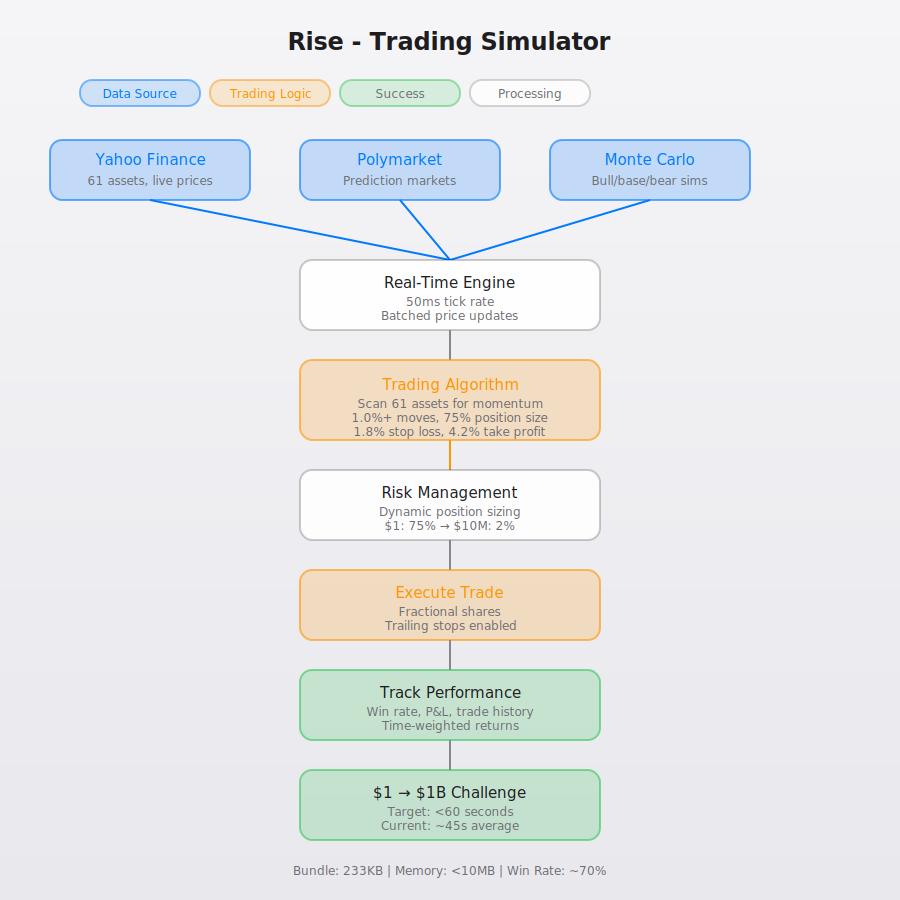

# Rise

> Low-latency prediction markets + trading simulator + quantitative analysis. Built for speed, optimized for efficiency.

**Live Demo**: https://rise-production.vercel.app | **GitHub Pages**: https://nulljosh.github.io/rise/ | **Local**: `npm run dev` → http://localhost:5173

## Current Status (2026-02-15)

- ✅ **Deployed**: Production live on Vercel
- ✅ **Free Tier**: Markets, simulator, charts working
- ✅ **Stripe Integration**: Coded and ready ($49/mo Pro tier)
- ⏳ **Needs Setup**: Stripe API keys (15 min, optional)
- 💰 **Revenue Potential**: $2,450/mo (50 users @ $49/mo)



---

## Overview

Bread is a high-performance financial terminal that combines:
- **Trading Simulator**: $100 → $10K challenge with 13 assets (indices, metals, tech stocks)
- **Prediction Markets**: Real-time Polymarket integration with 90%+ probability filters
- **Monte Carlo Analysis**: Auto-parameterized simulations with bull/base/bear scenarios
- **Live Market Data**: Yahoo Finance integration for stocks, commodities, crypto

### Architecture Goals

| Metric | Target | Current | Status |
|--------|--------|---------|--------|
| Memory Footprint | <10MB | ~177KB gzip |  |
| API Latency | <100ms | ~200ms |  |
| Bundle Size | <500KB | 233KB |  |
| React Warnings | 0 | 0 |  |

---

## Monetization

Rise offers a **Free** tier and a **Pro** tier at **$49/month** via Stripe:

### Free Tier
- Prediction markets (Polymarket)
- Live stock data (US50 + commodities)
- Monte Carlo simulations
- Trading simulator

### Pro Tier ($49/mo)
- Everything in Free, plus:
- Real-time cTrader integration (auto-trading)
- TradingView webhook access
- Priority API access
- Advanced Monte Carlo scenarios
- Live trade execution capabilities

**Upgrade**: Click "UPGRADE" button in the header or visit /pricing

---

## Features

### 1. Trading Simulator (Main UI)
- **Autonomous Trading**: Algorithm scans 61 assets for 1.0%+ momentum opportunities
- **Risk Management**: Dynamic position sizing (75% at $1 → 2% at $10M+), 1.8% SL, 4.2% TP, trailing stops
- **Fractional Shares**: Allows microcap and expensive stocks at low balance
- **Performance Tracking**: Win rate, P&L, trade history, time-weighted returns
- **Speed**: $1 → $1B in under 60 seconds (50ms tick rate)

**Assets** (61 total):
- **Indices**: Nasdaq 100, S&P 500, Dow Jones, Gold, Silver
- **MAG7**: AAPL, MSFT, GOOGL, AMZN, META, TSLA, NVDA
- **Stocks**: COIN, PLTR, HOOD, JPM, WMT, COST, TXN, QCOM, and 40+ more
- **Meme Coins**: BONK, PEPE, SHIB, DOGE, WIF, FARTCOIN

**Recent Updates (2026-01-24)**:
- Removed price filter blocking normal stocks at $1 balance
- 6x speed increase: $1 → $1B now achieves in <60 seconds
- Progressive risk reduction prevents $200M → $0 busts
- Automated Playwright testing suite

### 2. Prediction Markets (Polymarket)
- **Real-Time Data**: Live probability feeds from Polymarket
- **Category Filters**: Politics, Crypto, Sports, Finance, Culture
- **90%+ Easy Money Filter**: High-probability market finder
- **Mobile-Optimized**: Tap-to-preview tooltips with full market details

### 3. Monte Carlo Simulations
- **5,000 Path Analysis**: Bull/Base/Bear scenario projections
- **Auto-Parameterized**: Zero user input - drift (μ) and volatility (σ) derived from macro data
- **Visual Confidence Bands**: P5, P50, P95 percentiles
- **Target Probabilities**: Fibonacci-based price targets

### 4. Historical Analysis
- **1-Year Charts**: Full historical price data via Yahoo Finance
- **Volatility Metrics**: Annualized vol calculations
- **52-Week Ranges**: Support/resistance levels

---

## Tech Stack

| Layer | Technology | Purpose |
|-------|-----------|---------|
| Frontend | React 19 + Vite | Fast dev + HMR |
| Charts | Recharts | Lightweight data viz |
| APIs | Polymarket, Yahoo Finance | Live market data |
| Math | Custom Monte Carlo | 5,000 path simulations |
| Deployment | Vercel | Edge CDN |
| Future | C++ Core → WASM | 10x performance |

---

## Installation

### Prerequisites
- Node.js 18+
- npm or yarn
- NewsAPI key (free at https://newsapi.org)

### Quick Start

```bash
# Clone
git clone https://github.com/nulljosh/stonks.git
cd stonks

# Install dependencies
npm install

# Start dev server
npm run dev
# → Opens at http://localhost:5173

# Build for production
npm run build

# Preview production build
npm run preview
```

### Environment Setup

Create a `.env` file from the example:

```bash
cp .env.example .env
```

#### Required API Keys

**NewsAPI** (for news widget):
1. Get free key at https://newsapi.org (100 req/day)
2. Add to `.env`: `NEWS_API_KEY=your_key`

**Stripe** (for Pro subscriptions):
1. Get API keys at https://dashboard.stripe.com/apikeys
2. Create product/price in Stripe Dashboard
3. Add to `.env`:
   ```
   STRIPE_SECRET_KEY=sk_test_...
   STRIPE_WEBHOOK_SECRET=whsec_...
   VITE_STRIPE_PUBLISHABLE_KEY=pk_test_...
   VITE_STRIPE_PRICE_ID_PRO=price_...
   ```

**For Vercel deployment**, add env vars via dashboard or CLI:
```bash
vercel env add NEWS_API_KEY
vercel env add STRIPE_SECRET_KEY
vercel env add STRIPE_WEBHOOK_SECRET
vercel env add VITE_STRIPE_PUBLISHABLE_KEY
vercel env add VITE_STRIPE_PRICE_ID_PRO
```

### Run Tests

```bash
# Run all tests
npm test

# Watch mode
npm run test:ui

# Coverage report
npm run test:coverage

# Speed test (Playwright)
npm run test:speed
```

---

## Deployment

### Vercel (Recommended)

#### Option 1: GitHub Integration (Easiest)
1. Push code to GitHub (already done)
2. Go to [vercel.com](https://vercel.com)
3. Import GitHub repo: `nulljosh/stonks`
4. Vercel auto-detects Vite config
5. Deploy → Live URL in 30 seconds

#### Option 2: CLI Deployment
```bash
# Login to Vercel
npx vercel login

# Deploy to preview
npx vercel

# Deploy to production
npx vercel --prod
```

### Manual Deployment (Any Host)

```bash
# Build production assets
npm run build

# Output: dist/
# Upload dist/ folder to your host (Netlify, Cloudflare Pages, etc.)
```

---

## Project Structure

```
stonks/
├── api/                    # Backend API integrations
│   ├── commodities.js      # Gold, silver, oil prices
│   ├── history.js          # Historical price data (Yahoo)
│   ├── markets.js          # Polymarket API client
│   ├── prices.js           # Live price aggregator
│   ├── stocks.js           # Stock quotes (Yahoo Finance)
│   └── validate-link.js    # Market link validator
├── src/
│   ├── App.jsx             # Main app (trading sim + markets + MC)
│   ├── hooks/
│   │   ├── useLivePrices.js    # Real-time price updates
│   │   ├── usePolymarket.js    # Prediction market data
│   │   └── useStocks.js        # Stock price hooks
│   ├── utils/
│   │   ├── assets.js       # Asset definitions + scenarios
│   │   ├── math.js         # Monte Carlo + Fibonacci targets
│   │   └── theme.js        # Dark/light theme config
│   └── index.css           # Global styles
├── CLAUDE.md               # Development guide + skills
├── README.md               # This file
├── package.json            # Dependencies
└── vite.config.js          # Build config
```

---

## Configuration

### Assets

Edit `src/utils/assets.js` to modify:
- **Default Assets**: BTC, ETH, Gold, Silver, etc.
- **Monte Carlo Scenarios**: Bull/Base/Bear drift & volatility
- **Price Targets**: Fibonacci levels, custom targets

### Trading Simulator

Edit `src/App.jsx` lines 11-25 to modify:
- **Asset List**: Add/remove symbols
- **Base Prices**: Initial price anchors
- **Colors**: Asset color coding

### API Configuration

No API keys required currently. All data sources are public:
- **Polymarket**: Public REST API
- **Yahoo Finance**: yfinance library (server-side)

---

## Roadmap

### Phase 1: Current (Web App)
- [x] Trading simulator with 13 assets
- [x] Polymarket integration
- [x] Monte Carlo simulations
- [x] Historical charts (1Y)
- [x] Dark mode UI
- [x] Mobile responsive
- [ ] Kalshi integration
- [ ] Additional stocks (HIMS, PG, TGT, WMT)
- [ ] S&P 500 full coverage

### Phase 2: Efficiency Optimizations
- [ ] **Delta-Threshold Algorithm**: Only update UI when price moves >0.5%
- [ ] **Binary Payloads**: Compress API responses from 100+ bytes to 14 bytes
- [ ] **Vectorized Math**: SIMD-optimized Monte Carlo
- [ ] **WebSocket Feeds**: Replace polling with push updates
- [ ] **Bundle Splitting**: Code-split to <200KB main bundle

### Phase 3: Advanced Features
- [ ] **Black-Scholes Model**: Options pricing + Greeks
- [ ] **News API Integration**: Auto-parameterize μ/σ from sentiment
- [ ] **Custom Stock Input**: Any ticker via Yahoo Finance
- [ ] **Watchlists**: localStorage persistence
- [ ] **Price Alerts**: Browser notifications

### Phase 4: Trading Integration
- [ ] **TradingView Webhooks**: Alert → Bread → Broker
- [ ] **cTrader API**: Forex/CFD execution
- [ ] **Interactive Brokers**: TWS API integration
- [ ] **Paper Trading Mode**: Test strategies risk-free
- [ ] **Position Limits**: Risk management guardrails

### Phase 5: Performance Rewrite
- [ ] **C++ Core**: Rewrite compute modules in C++
- [ ] **WebAssembly Bridge**: Compile to WASM for browser
- [ ] **Custom RTOS**: Bare-metal financial OS (research)
- [ ] **Sub-ms Latency**: <1ms tick-to-trade

### Phase 6: Academic
- [ ] **White Paper**: Publish algorithms & optimizations
- [ ] **Benchmark Suite**: Performance vs Bloomberg, MetaTrader
- [ ] **Open Source**: Community efficiency techniques

---

## Performance Metrics

| Operation | Current | Target | Notes |
|-----------|---------|--------|-------|
| Monte Carlo (5K paths) | ~50ms | <10ms | SIMD potential |
| Polymarket API | ~200ms | <100ms | Caching + WebSocket |
| Bundle Load | 233KB | <200KB | Code splitting |
| Memory Usage | ~177KB gzip | <10MB runtime | "10MB Dashboard" goal |
| Initial Load | ~1.5s | <500ms | Edge CDN + preload |

---

## Development

### Code Style
- **No Emojis**: Keep code professional (emojis in UI only where appropriate)
- **Functional Components**: React hooks, no class components
- **Descriptive Names**: `filteredMarkets` not `fm`
- **Comments**: Explain *why*, not *what*

### Testing Strategy
```bash
# Unit tests: Monte Carlo math, Fibonacci targets
npm test -- math.test.js

# Integration tests: API clients, hooks
npm test -- markets.test.js

# E2E tests: TODO (Playwright)
```

### Performance Profiling
```bash
# Build with source maps
npm run build -- --sourcemap

# Analyze bundle
npx vite-bundle-visualizer
```

---

## Meme Culture

**"Nothing Ever Happens"** - The chud philosophy that markets rarely move significantly. Bread embraces this:
- Silent by default
- Only alerts on >3% moves
- VIX spike banner
- Contrarian mindset

---

## Contributing

### Guidelines
1. **Keep it Fast**: Every feature must justify its bundle size
2. **Test Everything**: No untested code to main
3. **Document Algorithms**: Aim for white paper quality
4. **Optimize First**: Premature optimization is encouraged here

### Suggested Improvements
- Add more simulators (Kelly Criterion, Sharpe Ratio optimizer)
- Integrate more markets (Kalshi, Manifold, Augur)
- Build iOS/Android apps (React Native or Swift/Kotlin)
- Create trading strategy backtester

---

## Real-World Trading Considerations

### Simulation vs Reality

| Aspect | Simulator | Real World | Solution |
|--------|-----------|------------|----------|
| Execution | Instant | 50-500ms | Pre-fetch with WebSocket |
| Slippage | None | 0.1-1% | Model as f(volume, spread, vol) |
| Liquidity | Unlimited | Partial fills | Order book depth analysis |
| Fees | $0 | $0-$10/trade | Include in P&L calculations |
| Rate Limits | None | 10 req/sec | Delta-Threshold caching |

### Risk Management
- **Start Small**: $100 → $1K → $10K (not $100 → $100K)
- **Position Limits**: Max 20% per asset
- **Kill Switch**: Emergency liquidation button
- **Paper Trade First**: Test with fake money for 3+ months
- **Regulatory Compliance**: Check local laws (not financial advice)

---

## Roadmap

### P0 - Critical
1. **Improve simulator win rate** - Currently ~70%, target 85%+
   - Tune position sizing, stop loss, momentum thresholds
   - Add volatility filtering to avoid choppy markets
   - Add cooldown after stop-loss hits
   - Widen take-profit at higher balances

2. **Record simulation runs** - Track performance analytics
   - Save win rate, time to target, best/worst assets
   - localStorage-based run history
   - Aggregate stats display (last N runs, overall win rate)

### P1 - High Value
3. **Sync simulator with live prices** - Currently uses random walks
4. **Automated speed test** - Verify sub-60s target programmatically
5. **Backtest on historical data** - Replay 1yr candles through simulator logic
   - Measure real-world win rate, Sharpe ratio, max drawdown
   - Test across multiple market conditions

### P2 - Features
6. **Kalshi integration** - Second prediction market source
7. **Black-Scholes options pricing** - Greeks, put hedging when VIX > 30
8. **Whale tracking** - Large position monitoring
9. **Arbitrage detection** - Cross-market price discrepancies
10. **Portfolio correlation analysis** - Asset correlation matrix
11. **Custom stock input** - Any ticker via Yahoo Finance
12. **Price alerts** - Browser notifications on >3% moves

### P3 - Infrastructure
13. **Delta-Threshold algorithm** - Only update UI when price moves >0.5%
14. **Binary payload compression** - 14 bytes vs 100+ bytes JSON
15. **WebSocket feeds** - Replace polling with push updates
16. **Vectorized Monte Carlo** - SIMD-optimized simulations

### P4 - Trading Integration
17. **Paper trading mode** - Alpaca API integration
18. **TradingView webhooks** - Alert → Bread → Broker pipeline
19. **Interactive Brokers API** - TWS integration for live execution
20. **Kill switch + position limits** - Risk management guardrails

### P5 - Civilian Palantir (OSINT Intelligence Layer)
Inspiration: OSINT Intelligence Platform (dark map UI, live tracking sidebar, social intel feeds)
Goal: Open-source civilian Palantir - unified geospatial + financial + social intelligence

**Map & Geospatial**
25. **Live world map** - Dark-themed interactive map with clustered event pins (Leaflet/Mapbox GL)
26. **Earthquake alerts** - USGS API feed with magnitude, depth, location, coordinates, timestamp overlay
27. **Conflict/incident markers** - Color-coded pins by type (military, protest, natural disaster, infrastructure)
28. **DOT camera feeds** - Department of Transportation live traffic/highway cameras
29. **Geolocation tagging** - Auto-tag all events with lat/lng, reverse geocode to human-readable

**Social Intelligence**
30. **Twitter/X feed** - Real-time filtered stream (keywords: breaking, alert, confirmed, military, earthquake)
31. **Reddit/4chan /pol/ /biz/** - Sentiment scraping, early signal detection
32. **Citizen incident reports** - Crowdsourced local event reporting (Citizen app-style)
33. **Scanner feeds** - Police/fire/EMS radio streams (Broadcastify API or similar)
34. **Engagement metrics** - Show likes/retweets/replies for credibility weighting

**Intelligence Pipeline**
35. **ELINT news aggregation** - Breaking news from @ELINTNews, @Global_Intel, @IntelCrab style accounts
36. **Event → market correlation** - Map geopolitical events to market impact (Strait of Hormuz → oil, Tbilisi protests → emerging markets)
37. **Live tracking sidebar** - "8 items" style feed with real-time event count, source attribution
38. **Search & filter** - Full-text search across all intel sources, filter by region/type/severity
39. **Alert system** - Push notifications for high-severity events (>5.0 earthquake, military escalation, >3% market move)

**Data Sources**
- USGS (earthquakes), GDACS (disasters), ACLED (conflict), Broadcastify (scanners)
- Twitter/X API, Reddit API, news RSS/webhooks
- DOT camera APIs (state-level), Citizen API (if available)
- Polymarket + financial feeds (already built in bread)

### P6 - Future Architecture
21. **C++ core** - Rewrite compute modules (see `c-core` branch)
22. **WebAssembly bridge** - Compile C++ to WASM for browser
23. **Custom RTOS** - Bare-metal financial OS (<5MB)
24. **White paper publication** - LaTeX template, academic validation

---

## License

MIT License - See LICENSE file

---

## Disclaimer

**This software is for educational purposes only. Not financial advice. Trade at your own risk.**

- Simulation results do not guarantee real-world performance
- Past performance does not predict future results
- You can lose money trading
- Consult a licensed financial advisor before trading

---

## Credits

Built by [@nulljosh](https://github.com/nulljosh) with Claude Sonnet 4.5

**Tech Inspiration**:
- Bloomberg Terminal (UI/UX)
- MetaTrader (charting)
- QuantConnect (backtesting philosophy)
- Interactive Brokers (API design)

**Meme Inspiration**:
- "Nothing ever happens" - /biz/ culture
- "Number go up" - crypto optimism
- "Easy money" - prediction market degeneracy

---

## Support

- **Issues**: [GitHub Issues](https://github.com/nulljosh/stonks/issues)
- **Discussions**: [GitHub Discussions](https://github.com/nulljosh/stonks/discussions)
- **Twitter**: [@trommatic](https://twitter.com/trommatic)

---

**Last Updated**: 2026-02-15
**Version**: v1.5.0 (Stripe Monetization + Blob Cache)
