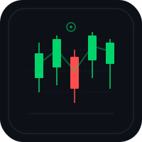

<div align="center">

# Opticon



Financial terminal and situation monitor. Live map, stock tickers, portfolio management, and prediction markets in one dashboard.

[opticon.heyitsmejosh.com](https://opticon.heyitsmejosh.com)

</div>

## Architecture


## Stack

- React 19 + Vite + MapLibre GL
- Vercel serverless (`api/gateway.js`, 20+ routes)
- Vercel KV (Upstash Redis) — auth, sessions, portfolio
- FMP batch API + Yahoo Finance (chunked fallback)
- Polymarket, GDELT, USGS, OSM, PredictHQ
- GDELT GDoc API for live news feed (`/api/news`) — free, no auth, 15-min updates, server-side deduplication (Jaccard similarity + URL normalization), 30+ city geo-keyword matching for map markers
- Stripe

## Dev

```bash
npm install
npm run dev
npm test -- --run
npm run build
```

## Roadmap

- [x] iOS companion app
- [x] PWA support
- [ ] Apple Pay via Stripe
- [ ] WebSocket real-time quotes
- [ ] Portfolio analytics dashboard
- [ ] Custom watchlist with alerts
- [ ] Prediction market accuracy tracking
